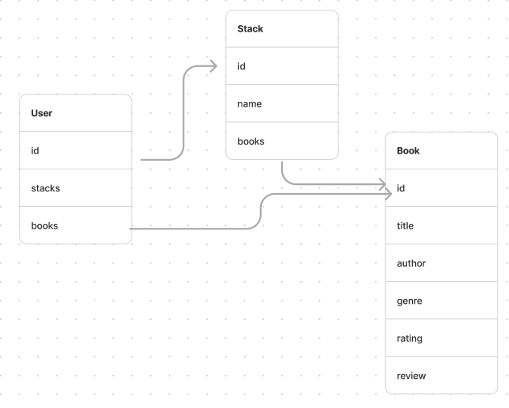

# Check out Stacks! <br> [github.io](//)


<!-- TABLE OF CONTENTS -->
<details>
  <summary>Table of Contents</summary>
  <ol>
    <li>
      <a href="#about-the-project">About The Project</a>
      <ul>
        <li><a href="#built-with">Built With</a></li>
      </ul>
    </li>
    <li><a href="#installation">Installation</a></li>
    <li><a href="#contributing">Contributing</a></li>
    <li><a href="#contact">Contact</a></li>
    <li><a href="#enhancements">Planned Enhancements</a></li>
  </ol>
</details>


<!-- ABOUT THE PROJECT -->
## About The Project


A Spotify-inspired book app which allows you to create Stacks (playlists) of your books. 
Each book holds details such as the title, author, genre, rating, review, and a favorite quote. 
Stacks can be modified as users see fit. Users have the ability to add books from their library to different stacks, change the names of those stacks, and delete the stacks altogether. All of this is customized to the user via the use of Google OAuth and PassportJS.


### Built With


### Designed With
#### [Figma](https://www.figma.com/file/PvWDyWcyyTht9QToGJGYba/Stacks?node-id=0-1&t=p5QoWEVzUcMdAmsc-0)<br>  <br>
AND <br> #### [Figjam (Schema)](https://www.figma.com/file/DypTqYe1AtbUfHDXhpheBj/Stacks---Schemas?type=whiteboard&node-id=8-3&t=HgFtAwWtDqaNB5Va-0) <br> #### [Figjam (ERD)](https://www.figma.com/file/wdij4KaISVI5NAI6TduLRf/ERD?type=whiteboard&node-id=0-1&t=HgFtAwWtDqaNB5Va-0)


<div id="title-container">


</div>


### Planned With
#### [Trello](https://trello.com/b/XIL9ai1F/stacks) <br> 


This is an image of the design process of the game
<br>


an image of our Login Screen


<!-- add mobile and desktop images -->

<p align="right">(<a href="#readme-top">back to top</a>)</p>

## Installation
 
1. Clone the repo
   ```sh
   git clone git@github.com:smgraywood/stacks.git
   ```
2. 
   ```sh
   npm i express ejs morgan passport passport-googleoauth express-session 
   ```
3. Get to coding! 😃 

<p align="right">(<a href="#readme-top">back to top</a>)</p>

<!-- CONTRIBUTING -->
## Contributing

Contributions are what make the open source community such an amazing place to learn, inspire, and create. Any contributions you make are **greatly appreciated**.

If you have a suggestion that would make this better, please fork the repo and create a pull request. You can also simply open an issue with the tag "enhancement".
Don't forget to give the project a star! Thanks again!

1. Fork the Project
2. Go through the Installation Process
3. Create your Feature Branch (`git checkout -b feature/AmazingFeature`)
4. Commit your Changes (`git commit -m 'Add some AmazingFeature'`)
5. Push to the Branch (`git push origin feature/AmazingFeature`)
6. Open a Pull Request

<p align="right">(<a href="#readme-top">back to top</a>)</p>

<!-- PLANNED ENHANCEMENTS -->
## Planned Enhancements

- [ ] Interface with Kindle to allow users to access their e-books via the stacks
- [ ] Search feature for the books list allowing users to search by genre, author, and title
- [ ] fill the books database via an api and then let users customize the information in each book
- [ ] implement a social media aspect where users could see eachothers stacks and share books

<p align="right">(<a href="#readme-top">back to top</a>)</p>
